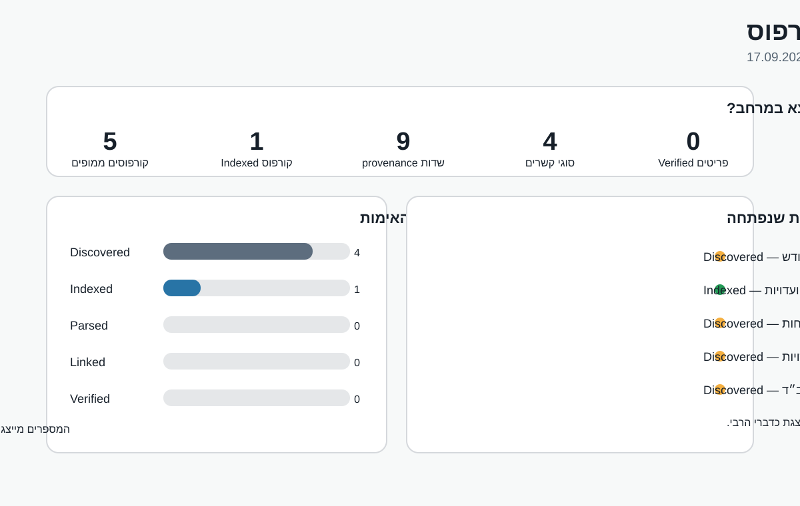

# מענה לדורות | יקום הרבי

ארכיון/מודל אינטראקטיבי מבוסס־מקורות של תורתו, מענותיו והתיעוד ההיסטורי של הרבי מנחם מענדל שניאורסון.

## התקדמות הקורפוס

הדשבורד נועד להציג **רק מה שקיים בפועל במאגר**, ולא הערכת היקף כללית. המספרים מתעדכנים לפי `data/sources.json`.

### משמעות השלבים

- **Discovered** — מקור/קורפוס אותר, אך טרם נבנה לו אינדקס פריטים מאומת.
- **Indexed** — נרשמו מטא־דאטה ומקור מדויק ברמת האינדוקס הרלוונטית.
- **Parsed** — תוכן המקור עובד למבנה נתונים בלי להשלים מידע חסר.
- **Linked** — נבנו קשרים מתועדים למקורות מקבילים/כפילויות/משפחות ראיות.
- **Verified** — הרשומה נבדקה מול מקור ישיר או עדות מקור מוסמכת ברמת הפריט.

> כלל יסוד: אין להציג הסקת AI, שחזור או השלמת הקשר כדברי הרבי. מקור חלקי נשאר מסומן כחלקי.
